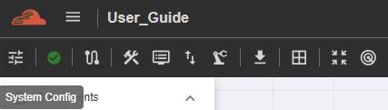
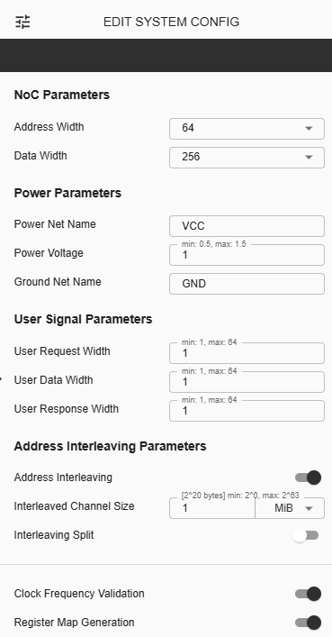

System Config
==========================================

This feature allows the user to modify the current settings of the project. The following items are the same items set initially when creating a project. To update the settings, user must click ‘System Config’ from action bar.

**Address Width** – The user needs to choose either 32 or 64 as the address width for the NoC project.

**Data Width** – The user needs to choose from 256, 512 or 1024 as the NoC Data Width. (This was previously configurable inside subtopology folder)

**Power Net Name** – This field is for naming Power Net. 

**Power Voltage** – This field is used to set the power voltage for the NoC project. The minimum configuration is 0.5, and the maximum configuration is 1.5.

**Ground Net Name** – This field is for naming Ground Net. 

**User Request Width** – This is an input field for AXI4 User Signal where the user are allowed to input any value between 1 to 64. 

**User Data Width** – This is an input field for AXI4 User Signal where the user is allowed to input any value between 1 and 64. 

**User Response Width** - This is an input field for AXI4 User Signal where the user is allowed to input any value between 1 and 64.

**Address Interleaving** - Refers to the technique of distributing memory address ranges across multiple targets or memory devices in a patterned or alternating manner. The default toggle setting is disabled. When enabled, the 'Interleaved Channel Size' and 'Interleaving Split' parameters will also appear.

  Interleaved Channel Size - allows the user to input the desired size and with "Bytes" as unit. 

  Interleaving Split - defines how a memory address range is divided (or split) into smaller segments for distribution among multiple targets or subordinate nodes in a NoC (Network-on-Chip) system. The default setting is disabled. The user can enable this using a toggle button.
    
**Clock Frequency Validation** – When toggled on, the frequency of each component in the topology must be set individually. When toggled off, setting individual frequencies is not required.

**Register Map Generation** - When toggled on, the Register Map tab becomes visible, allowing the user to view the Register Map table based on the current topology design.

