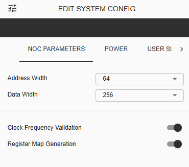
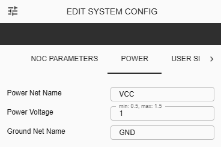
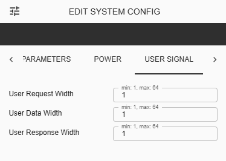
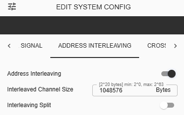
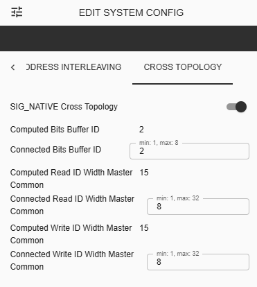

=========================================================
NC-NoC System Configuration Panel
=========================================================

The **System Config** workspace acts as the global architectural registry file for your Non-Coherent Network-on-Chip (NC-NoC) project. Modifying parameters within this pane redefines the structural top-level RTL metadata wrapper, rewriting fundamental bus geometries, physical routing constraints, and optional hardware verification features across all subtopology domains simultaneously.

--------------------------------------------------------------------------------

Editing the Global Configuration Fabric
=============================================

To modify established top-level properties after initial project instantiations, click the **System Config** control button located on the primary action bar panel.

--------------------------------------------------------------------------------

Foundational Data and Address Geometries
============================================

The core structural dimensions of the memory-mapped transport layers are governed by two definitive bit-width configurations:

Address Width
   Sets the maximum addressing boundary vector for the routing grid matrix. Architects must select either **32-bit** or **64-bit** space models to match target processor execution environments.

Data Width
   Determines the fundamental parallel bus line width of the central switch network elements. Selectable between **256**, **512**, or **1024** bits. 
   
   .. note::
      *Historical Architectural Shift:* Data Width properties are now evaluated at the global project level, overriding legacy setups that restricted this field to localized subtopology folder parameters.

Clock Frequency Validation
   **Toggled ON:** Unlocks independent local control clocks. Every discrete IP node dropped on the canvas grid must be configured with a localized frequency setting.
   **Toggled OFF:** Standardizes clocking. Eliminates localized clock input constraints to streamline basic verification steps.

Register Map Generation
   **Toggled ON:** Instructs the compilation engine to compile a comprehensive, software-accessible hardware-software interface (HSI) registry sheet. Instantiates the visible **Register Map** tab within your active project workspace folder tree.

--------------------------------------------------------------------------------

Global Electrical and Power Grid Net Mapping
================================================

When configuring the top-level macro-power mesh layout, the system enforces strict physical bounds to prevent logic state collapse:

* **Power Net Name:** The legal alphanumeric tracking string assigned to identify the primary positive supply voltage rail network line (e.g., ``VDD_GLOBAL``).
* **Ground Net Name:** The reference net flag mapping the physical ground return plane line layer (e.g., ``VSS_GLOBAL``).

.. warning::
   **Operating Potential Constraints:**
   The **Power Voltage** input field dictates the steady-state potential applied across the global network logic fabric. The integrated design rule check (DRC) block enforces strict boundary limits on this field:
   
   * **Minimum Voltage Boundary:** ``0.5 V``
   * **Maximum Voltage Boundary:** ``1.5 V``

--------------------------------------------------------------------------------

Advanced Protocol Extensions & Memory Stripping
====================================================

.. tab-set::

   .. tab-item:: AXI4 User Signals

      When utilizing extended AMBA AXI4 protocol interfaces, you can allocate dedicated sideband bit lines to carry proprietary transaction metadata (such as custom security tokens, cache allocation tags, or internal routing keys).
      
      * **User Request Width:** Input field establishing sideband bits for read/write address channel metadata. Accepts integer values from ``1`` to ``64``.
      * **User Data Width:** Input field establishing sideband bits for write data channel annotations. Accepts integer values from ``1`` to ``64``.
      * **User Response Width:** Input field establishing sideband bits for transaction acknowledgment channel tracing. Accepts integer values from ``1`` to ``64``.

   .. tab-item:: Address Interleaving

      **Address Interleaving** splits consecutive memory access blocks across parallel destination target slices or separate storage endpoints to bypass physical hardware bottlenecks and maximize memory channel utilization.

      * **Interleaved Channel Size:** Defines the linear stride size step mapped in **Bytes** across alternating memory targets.
      * **Interleaving Split:** Toggles an active address segment division routine. When enabled via the toggle control, it activates smaller structural segment distribution blocks across bound downstream slave blocks.

   .. tab-item:: Cross Topology 

      * **SIG_NATIVE Cross Topology** toggle button to enable the Cross Topology function, validating if there is a SIG-NATIVE device in eport or iport. 

      * **Computed Bits Buffer ID** calculated bit-width required to uniquely index the maximum buffer depth found across all network ingress ports, scaling logarithmically with the largest buffer size

      * **Computed Read ID Width Master Common** automatically calculated maximum read transaction ID width, derived from the highest read ID width configured across all AXI ingress ports in the network. This will be increased by 7 if SIG-NATIVE is                present in any eport or iport.

      * **Computed Write ID Width Master Common** automatically calculated maximum write transaction ID width, derived from the highest write ID width configured across all AXI ingress ports in the network. This will be increased by 7 if SIG-NATIVE is             present in any eport or iport.

      When the SIG_NATIVE Cross Topology is enabled, additional fields are displayed, these will allow the user to configure the desired Bits Buffer ID, Read ID Width and Write IF Width :

      * **Connected Bits Buffer ID** allowing the user to input a desired Bits Buffer ID

      * **Connected Read ID Width Master Common** allowing the user to input a desired Read ID Width

      * **Connected Write ID Width Master Common** allowing the user to input a desired Write ID Width

