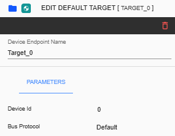
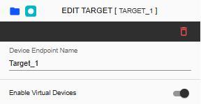
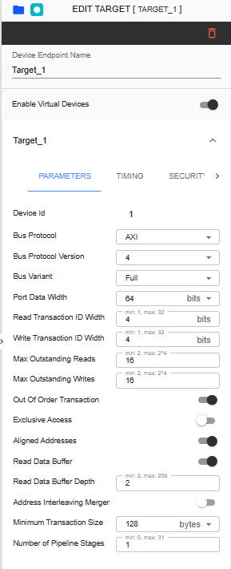
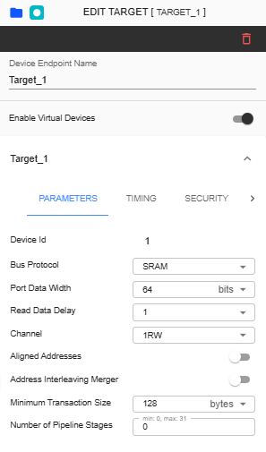
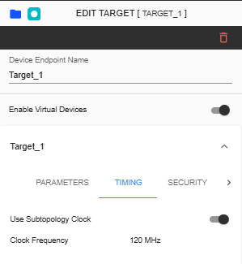
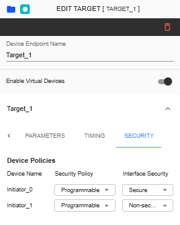

Target Configuration
===========================================

Configuring a Target device involves various settings. There are two types of targets: Default Target and Target. 

Default Target - A device that acts as the default communication slave in a master-slave setup. 

Target Device - The device that is currently being controlled or receiving commands from the master.

**Device ID** – Device ID “0” is for reserved for Default Slave only. 

**Bus Protocol** – This read-only parameter displays the name "Default", representing the Default Slave

This is a toggle button for enabling or disabling virtual devices. The default setting is disabled. When the user enables this button, adding virtual devices to the specific target becomes possible.

This topic will be discussed in **6. Virtual Devices**. 

**Subtopology** –A dropdown list allows users to change the subtopology assigned to the selected target. This dropdown can be modified and reassigned to another available subtopology based on the topology configuration.
  
**Name** – Label name assigned for selected target. This is an input field where only alphanumeric keys and underscores are allowed.
  
**Device Id** – This ID is unique for each component.

**Bus Protocol** – The selected item here will be assigned as the protocol for the Initiator device. The available selections are AXI, AHB, APB, SIG_NATIVE, SRAM and ‘Default’. ‘Default’ will be unavailable once it was already selected in port ‘E0’. 

**Bus Protocol Version** – The list of versions depends in ‘Bus Protocol’ that has been selected. Please check the table below as reference.

**Bus Variant** – The list of variants for the selected 'Bus Protocol' will be displayed here. Please check the table below as reference. 

**Write Transaction ID Width** – Refers to the number of bits allocated to identify write transactions. 

**Read Transaction ID Width** – Refers to the number of bits used to identify read transaction. 

**Port Data Width** – Refers to the Data Width you will be assigned to the connected port.  Available list will depend on what Bus Protocol was selected. This is not displayed in SIG-NATIVE. Maximum possible value depends on the 'Data Width' set in System Configuration.

**User Request Width** – This parameter is available in AHB or APB bus protocol. User can choose between 16 or 32 bits. 

**User Data Width** – This parameter is available in AHB or APB bus protocol. User can choose between 16 or 32 bits. 

**Max Outstanding Writes** – The number of allowed outstanding writes limited by the system’s architecture. 

**Max Outstanding Reads** – The number of allowed outstanding reads limited to help manage the bandwidth. 

Additional Notes:  

If exclusive access is disabled, the following should be observed:
  -  Max allowable value of Max Outstanding Reads is 2^(Read Transaction ID Width)
  -  Max allowable value of Max Outstanding Writes is 2^(Write Transaction ID Width)

If exclusive access is enabled, the following should be observed:
  -  Read Transaction ID Width and Write Transaction ID Width should have common value (change to R/W Transaction ID Width)
  -  Max allowable value of Max Outstanding Reads is 2^(common ID Width-1)
  -  Max allowable value of Max Outstanding Writes is 2^(common ID Width-1)
  -  Max Exclusive access LUT Size is 2^(common ID Width-1)
  -  since min value for max outstanding write/read and lut size when exclusive access is enabled is 1, if exclusive access is disabled (given that the current value is 1), it should be updated to 2 (min value when disabled)
  -  Max Outstanding Read/Write should automatically be updated if current value > max allowable value 
  -  When Exclusive Access is enabled, it should display R/W transaction ID Width instead of separate Read and Write Transaction Width

**Out of Order Transaction** – Toggle button where user can enable or disable out of order transactions. This setting will only appear in AXI3 and AXI4-Full bus protocols.

**Exclusive Access** – This parameter is a toggle button where user can enable or disable the Exclusive Access function. Default is disabled and can only be enabled when 'Out of Order Transaction' is enabled. When enabled, user must input the ‘Exclusive Access LUT Size’. This parameter is configurable only using AXI3 and AXI4-Full bus protocols. 

**Exclusive Access LUT Size** – This input field is displayed when ‘Exclusive Access’ is enabled. User can input from 2 to 256 as the size. 

**Aligned Addresses** – This parameter is displayed for all target devices except in SIG-NATIVE devices. 

**Read Data Buffer** – This parameter allows the user to configure the Read Data Buffer for a selected Target device. Toggle on to enable and toggle off to disable. This parameter is displayed in all Bus Protocols except in SIG_NATIVE and SRAM.

**Read Data Buffer Depth** – This parameter is an input field that defines the data buffer size for the selected device. Supported values range from 2 to 256. 

**Address Interleaving Merger** - This parameter is DISABLED and non-configurable as default. This will only be enabled when Address Interleaving in System Config is ENABLED. Please check the `Address Interleaving <addressinterleaving.html>`_ page for more information. 

**Minimum Transaction Size** - This parameter is ENABLED and configurable. This will only be validated when 'Target Address Interleaving'. Check the `Address Interleaving <addressinterleaving.html>`_  page to know more. 

**Number of Pipeline Stages** - This parameters allows the user to set specific number of pipeline stages for the selected Target device. Using AXI Protocols, default value is 1. This parameter is not available when using SIG_NATIVE bus protocol.

**Read Data Delay** – This setting is only available in ‘SRAM’ Bus Protocol. Time interval to set for a read request. User can choose either 1 or 2.

**Channel** – This setting is only available in ‘SRAM’ Bus Protocol. User can choose either 1RW (1 Read/Write) or 1R1W (1 Read 1 Write). 

+------------------+--------------------------+----------------------+
| **Bus Protocol** | **Bus Protocol Version** |    **Bus Variant**   |
+==================+==========================+======================+
|      AXI         |           3              |          N/A         |
+------------------+--------------------------+----------------------+
|                  |           4              |  Full, Lite, Stream  |
+------------------+--------------------------+----------------------+
|      AHB         |           3              |        Lite          |
+------------------+--------------------------+----------------------+
|                  |           5              |          N/A         |
+------------------+--------------------------+----------------------+
|      APB         |           3              |          N/A         |
+------------------+--------------------------+----------------------+
|                  |           5              |          N/A         |
+------------------+--------------------------+----------------------+
|    SIG_NATIVE    |          N/A             |          N/A         |
+------------------+--------------------------+----------------------+
|    SRAM          |          N/A             |          N/A         |
+------------------+--------------------------+----------------------+

Timing tab displays the Use Subtopology Clock and Frequency parameters. By default, Use Subtopology Clock is enabled, and the Frequency value follows the frequency set in the Subtopology folder.

**Use Subtopology Clock** – When enabled, the Frequency will be the same as the Subtopology clock. When disabled, the Frequency must be set in MHz.

**Frequency** – This refers to the speed at which a processor can execute instructions. By default, the value displayed here follows the value set in the Subtopology folder. This field will be available if 'Use Subtopology Clock' is disabled.

**Device Policy** – Policy or configuration assigned for the connected Initiator device. This will also reflect in Initiator device’s setting. Choose from Passthrough, Programmable (Interface Security: Secure or Non-Secure), Blocked, and Fixed-Secure.
