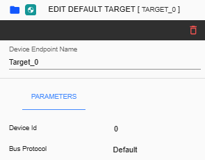
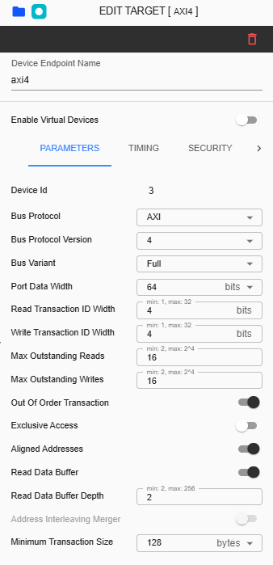
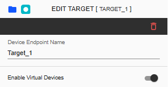
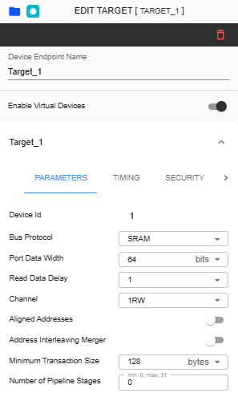
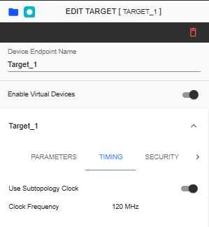
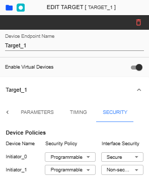

===========================================
Target Interface Configuration
===========================================

Configuring a Target (Slave) device involves defining its signaling protocol rules, outstanding transaction queues, physical buffer profiles, security policies, and clock domains. The system parses target configurations using two distinct structural classifications:

Default Target
   A specialized, fail-safe communication block that handles unmapped or dangling transactions. It acts as the ultimate catch-all slave in a master-slave topology layout.

Target Device
   A standard memory-mapped peripheral block (e.g., DRAM controllers, SRAM arrays, or high-speed hardware blocks) receiving commands from initiating master devices across the fabric.

--------------------------------------------------------------------------------

Default Target Constraints
==============================

The Default Target acts as a system fallback node and enforces fixed, unalterable base properties to guarantee error trapping:

* **Device ID Mapping:** The identifier value ``0`` is strictly reserved by the structural compilation tool for the **Default Slave** block. No regular target node can claim this index.
* **Protocol Assignment:** Renders a read-only parameter string showing ``Default``, identifying its role as port ``E0``'s error handling anchor.

--------------------------------------------------------------------------------

Primary Target Parameter Specifications
==========================================

Clicking a standard Target module on the visual canvas populates a detailed multi-tab properties inspector on the right-hand panel.

Subtopology
   A dropdown field to change or assign the component's parent subtopology directory. The node will dynamically inherit its parent's power and clock behaviors upon reallocation.

Name
   The unique string label assigned to the target instance. The input field accepts **alphanumeric keys and underscores** (``_``) only.

Device ID
   An uneditable, unique integer index assigned automatically to distinguish the block across the global NoC registry.

Bus Protocol, Version, & Variants
   Defines the physical signaling protocol standard used to link the target to the outer router fabric interface. Available iterations scale dynamically based on your selection matrix:

   .. list-table:: Supported Interconnect Protocols Matrix
      :widths: 30 30 40
      :header-rows: 1
      :stub-columns: 1

      * - Bus Protocol
        - Protocol Version
        - Bus Variant Options
      * - **AXI**
        - ``3``, ``4``
        - ``Full``, ``Lite``, ``Stream`` *(Stream/Lite unique to v4)*
      * - **AHB**
        - ``3``, ``5``
        - ``Lite`` *(v3 only)*, ``N/A``
      * - **APB**
        - ``3``, ``5``
        - ``N/A``
      * - **SIG_NATIVE**
        - *N/A*
        - ``N/A`` (Proprietary Signature IP protocol)
      * - **SRAM**
        - *N/A*
        - ``N/A`` (Direct memory array macro interface)

--------------------------------------------------------------------------------

Signaling and Transaction Queuing Controls
=============================================

Virtual Devices Toggle
   Enables or disables multi-channel virtual device overlays on this explicit endpoint target block. Once activated, developers can append logical channels to slice peripheral spaces *(For complete structural rules, see Section 6: Virtual Devices)*.

Write / Read Transaction ID Width
   Specifies the exact bit allocation designated to trace concurrent master transactions. Higher values permit greater scheduling flexibility but expand the synthesized logic surface area.

Port Data Width
   Declares the raw line width of the physical data bus block. Selection capabilities adapt to your specified bus protocol, capped by the absolute global **Data Width** restriction established within the master System Configuration. *(Hidden for SIG_NATIVE setups)*.

User Request / Data Width
   Accessible explicitly when compiling under **AHB** or **APB** environments. Restricts structural sideband signal metadata processing paths strictly to **16-bit** or **32-bit** options.

Max Outstanding Writes / Reads
   Imposes hard architectural queue limits on parallel transaction tracking. These knobs prevent master nodes from flooding peripheral buffers, balancing traffic throughput against structural logic saturation.

--------------------------------------------------------------------------------

Exclusive Access Configuration & ID Balancing
===================================================

When tuning targets under **AXI3** or **AXI4-Full** architectures, you can activate specialized transaction tracking levers to govern out-of-order execution states:

Out of Order Transaction
   Toggle feature enabling or disabling non-sequential transaction processing paths across the target block interface.

Exclusive Access
   A binary toggle allowing the target to track semaphore-locked atomic actions across multi-core elements. Can only be enabled when **Out of Order Transaction** is active.

.. list-table:: Exclusive Access Architectural Constraints
   :widths: 50 50
   :header-rows: 1

   * - Exclusive Access DISABLED
     - Exclusive Access ENABLED
   * - Max Outstanding Reads $\le 2^{\text{Read ID Width}}$
     - Separate ID widths unify into a combined **R/W Transaction ID Width** field.
   * - Max Outstanding Writes $\le 2^{\text{Write ID Width}}$
     - Max Outstanding Reads $\le 2^{(\text{Common ID Width} - 1)}$
   * - Default lower boundary limit values scale to a minimum baseline index of **2**.
     - Max Outstanding Writes $\le 2^{(\text{Common ID Width} - 1)}$
   * - *Note: The layout automatically pulls down values if properties exceed maximum mathematical boundaries.*
     - **Exclusive Access LUT Size:** New input field unlocks. Limits the target lock table entry size from **2 to 256** slots ($\le 2^{(\text{Common ID Width} - 1)}$).

--------------------------------------------------------------------------------

Buffer Allocations & Memory-Interleaving Overrides
======================================================

Aligned Addresses
   Enforces alignment restrictions on inbound bursts. Displayed for all protocols except ``SIG-NATIVE``.

Read Data Buffer & Depth
   Unlocks a dedicated internal queue array block to buffer out-of-order read data streams before driving lines back onto the router fabric. Fully supported from a depth parameter scale of **2 to 256** entries. *(Omitted for SIG_NATIVE and SRAM interfaces)*.

Address Interleaving Merger
   A system-locked conditional parameter. Remains unconfigurable and grayed-out by default. Unlocks dynamically *only* when the global **Address Interleaving** flag is enabled inside the master System Config workspace panel.

Minimum Transaction Size
   The validation limit for interleaved packet framing. Active exclusively during interleaved target routing routines.

SRAM Specific Controls
   When the target protocol is set to direct ``SRAM`` macros, specialized memory-cell configuration fields appear:
   
   * **Read Data Delay:** Dictates the exact latency cycle delay step (choose **1** or **2** cycles) required to sample data bits out of the memory array.
   * **Channel Typology:** Configures the RAM physical array port access type. Select between ``1RW`` (Single shared Read/Write port) or ``1R1W`` (Dedicated concurrent 1-Read / 1-Write port tracks).

--------------------------------------------------------------------------------

Timing and Security Frameworks
===================================

The sub-panels manage downstream physical integration properties:

Timing Configuration
---------------------

* **Use Subtopology Clock:** Enabled by default. Forces the component interface to seamlessly inherit the master clock profile assigned to its parent Subtopology directory. Disabling this block unlocks local overrides.
* **Frequency:** Active solely when the tracking check box above is cleared. Allows designers to type a unique local performance rating scaled directly in **MHz**.

Security Configuration
-----------------------

**Device Policy:** Dictates the access boundaries enforced against incoming initiator requests attempting to drive transactions onto this target block. The dropdown menu provides four security profiles:

Passthrough
   Forwards all inbound transaction payloads raw without inspecting or scrubbing security bit tags.

Programmable
   Unlocks dynamic software-defined control. Evaluates individual transaction streams as explicitly **Secure** or **Non-Secure** on-the-fly.

Blocked
   Completely severs access. Isolates the target from all master blocks on the active topology layout grid.

Fixed-Secure
   Locks hardware access down. Rejects all non-secure master transactions automatically, generating an instant fabric error line flag.
