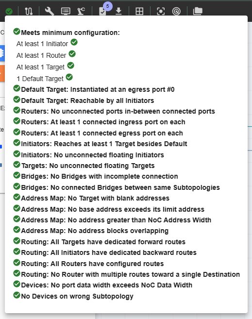

NC-NoC Topology Validation
====================================================

This feature ensures the correct and efficient layout and connectivity of the circuit components. It involves verifying that the physical and logical connections in the design meet the desired specifications and function correctly under all operating conditions. 
  -	Connectivity Verification 
  -	Layout Check
  -	Design Rule Check
  -	Signal Analysis
  -	Timing Analysis
  -	Power and Network Ground Validation

The ‘Topology Validation’ button in the Action bar displays a list of items detailing the validations that the topology will undergo before passing. 

NC-NoC Topology Validation 
-------------------------------------------------------

