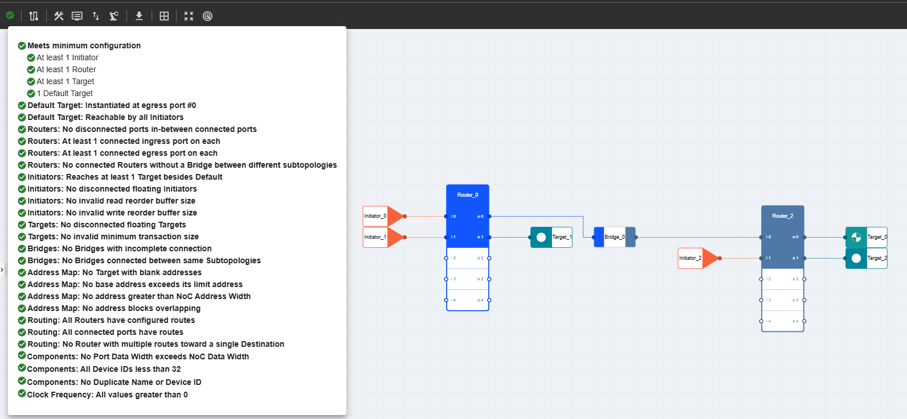
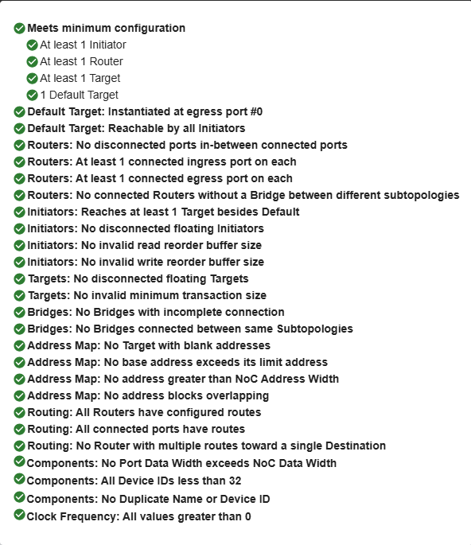

====================================================
NC-NoC Topology Validation Rules
====================================================

The **Non-Coherent Network-on-Chip (NC-NoC) Topology Validation** feature checks the correctness and completeness of a Non-Coherent Network-on-Chip (NC-NoC) design. It ensures that routers, devices, and address mappings are properly defined and interconnected before simulation or hardware implementation.

--------------------------------------------------------------------------------

Validation Purpose & Objective Profiles
===========================================

* **Detect configuration errors** early in the design phase.
* **Verify network connectivity** across all routers and devices.
* **Validate address mapping rules** to avoid runtime conflicts.
* **Ensure the topology meets** the minimum design requirements.

--------------------------------------------------------------------------------

Interactive DRC Workflow Sequence
======================================

The platform design loop relies on an iterative validation sign-off cycle:

1. **Design or import** an NC-NoC topology.
2. **Run Validation** from the toolbar.
3. **Review the validation messages** (errors, warnings, passes).
4. **Correct issues directly** in the topology or address map.
5. **Re-run validation** until all checks pass.

--------------------------------------------------------------------------------

Comprehensive Rule Matrix Categories
==========================================

When initialized, the validation subsystem evaluates the netlist file across the following exact functional parameters. Every tracking item must clear successfully to pass total validation:

Global & Foundational Constraints
---------------------------------

Meets Minimum Configuration
   Ensures the topology includes at least 1 Initiator, 1 Router, 1 Target, and 1 Default Target.

Default Target: Instantiated at egress port #0
   Verifies that the default target is correctly created at the expected port.

Default Target: Reachable by all Initiators
   Confirms that every Initiator can access the default target.

Routers & Subtopology Boundaries
--------------------------------

Routers: No unconnected ports in-between connected ports
   Ensures router ports are consistently connected without gaps.

Routers: At least 1 connected ingress port on each
   Validates that every router has an active ingress port.

Routers: At least 1 connected egress port on each
   Validates that every router has an active egress port.

Routers: No connected Routers without a Bridge between different subtopologies
   Ensures routers from different subtopologies are linked only through bridges.

Initiator Device Parameters
---------------------------

Initiators: Reaches at least 1 Target besides Default
   Confirms initiators can access a functional target, not just the default.

Initiators: No unconnected floating Initiators
   Checks that all initiators are linked to the topology.

Initiators: No invalid read reorder buffer size
   Checks the values of all Read Reorder Buffer Size in each Initiator.

Initiators: No invalid write reorder buffer size
   Checks the values of all Write Reorder Buffer Size in each Initiator.

Target Device Parameters
------------------------

Targets: No unconnected floating Targets
   Ensures all targets are properly connected.

Targets: No invalid minimum transaction size
   Ensures that all target devices has a valid and acceptable Minimum Transaction Size.

Bridge Architecture Parameters
------------------------------

Bridges: No Bridges with incomplete connection
   Validates that all bridges are fully connected on both ends.

Bridges: No connected Bridges between same Subtopologies
   Prevents redundant or invalid bridge connections within the same subtopology.

Address Map Parameters
----------------------

Address Map: No Target with blank addresses
   Checks that every target has an assigned address range.

Address Map: No base address exceeds its limit address
   Ensures base addresses are always less than or equal to limit addresses.

Address Map: No address greater than NoC Address Width
   Verifies that all addresses fall within the allowed NoC width.

Address Map: No address blocks overlapping
   Prevents overlapping memory ranges across components.

Crossbar Routing Parameters
---------------------------

Routing: All Targets have dedicated forward routes
   Confirms each target is reachable through a forward path.

Routing: All Routers have configured routes
   Validates that every router has proper routing rules set.

Routing: All connected ports have routes
   Validated that every port connection has a configured routes either manually or by auto-route feature.

Routing: No Router with multiple routes toward a single Destination
   Prevents conflicting routes to the same destination.

Component & Clock Parameters
----------------------------

Components: No Port Data Width exceeds NoC Data Width
   Ensures port widths comply with the maximum NoC data width.

Components: All Device IDs less than 32
   Verifies device IDs stay within valid range (<32).

Components: No Duplicate Name or Device ID
   Ensures all devices are uniquely identified.

Clock Frequency: All values greater than 0
   Validates that all clock frequencies are properly set.
