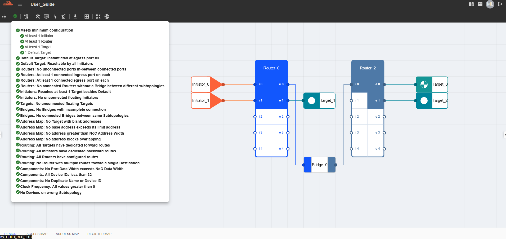

NC-NoC Topology Validation
====================================================

The NC-NoC Topology Validation feature checks the correctness and completeness of a Non-Coherent Network-on-Chip (NC-NoC) design. It ensures that routers, devices, and address mappings are properly defined and interconnected before simulation or hardware implementation.

**Purpose**

- Detect configuration errors early in the design phase.

- Verify network connectivity across all routers and devices.

- Validate address mapping rules to avoid runtime conflicts.

- Ensure the topology meets the minimum design requirements.

**Workflow**

- Design or import an NC-NoC topology.

- Run Validation from the toolbar.

- Review the validation messages (errors, warnings, passes).

- Correct issues directly in the topology or address map.

- Re-run validation until all checks pass.

The ‘Topology Validation’ button in the Action bar displays a list of items detailing the validations that the topology will undergo before passing. 

NC-NoC Validations
--------------------------------------------------

1. Meets Minimum Configuration

  – Ensures the topology includes at least 1 Initiator, 1 Router, 1 Target, and 1 Default Target.

2. Default Target: Instantiated at egress port #0
 
  – Verifies that the default target is correctly created at the expected port.

3. Default Target: Reachable by all Initiators

  – Confirms that every Initiator can access the default target.

4. Routers: No unconnected ports in-between connected ports 

  – Ensures router ports are consistently connected without gaps.

5. Routers: At least 1 connected ingress port on each

  – Validates that every router has an active ingress port.

6. Routers: At least 1 connected egress port on each 

  – Validates that every router has an active egress port.

7. Routers: No connected Routers without a Bridge between different subtopologies 

  – Ensures routers from different subtopologies are linked only through bridges.

8. Initiators: Reaches at least 1 Target besides Default 
  
  – Confirms initiators can access a functional target, not just the default.

9. Initiators: No unconnected floating Initiators 

  – Checks that all initiators are linked to the topology.

10. Initiators: No invalid read reorder buffer size 

  - Checks the values of all Read Reorder Buffer Size in each Initiator. 

11. Initiators: No invalid write reorder buffer size 

 - Checks the values of all Write Reorder Buffer Size in each Initiator. 

10. Targets: No unconnected floating Targets 

  – Ensures all targets are properly connected.

11. Targets: No invalid minimum transaction size

  - Ensures that all target devices has a valid and acceptable Minimum Transation Size.

12. Bridges: No Bridges with incomplete connection 

  – Validates that all bridges are fully connected on both ends.

13. Bridges: No connected Bridges between same Subtopologies 

  – Prevents redundant or invalid bridge connections within the same subtopology.

14. Address Map: No Target with blank addresses 

  – Checks that every target has an assigned address range.

15. Address Map: No base address exceeds its limit address 

  – Ensures base addresses are always less than or equal to limit addresses.

16. Address Map: No address greater than NoC Address Width 
  
  – Verifies that all addresses fall within the allowed NoC width.

17. Address Map: No address blocks overlapping 

  – Prevents overlapping memory ranges across components.

18. Routing: All Targets have dedicated forward routes 

  – Confirms each target is reachable through a forward path.

19. Routing: All Routers have configured routes 
  
  – Validates that every router has proper routing rules set.

20. Routing: All connected ports have routes

  - Validated that every port connection has a configured routes either manually or by auto-route feature. 

21. Routing: No Router with multiple routes toward a single Destination 

  – Prevents conflicting routes to the same destination.

22. Components: No Port Data Width exceeds NoC Data Width 

  – Ensures port widths comply with the maximum NoC data width.

23. Components: All Device IDs less than 32 

  – Verifies device IDs stay within valid range (<32).

24. Components: No Duplicate Name or Device ID 

  – Ensures all devices are uniquely identified.

25. Clock Frequency: All values greater than 0 

  – Validates that all clock frequencies are properly set.

.. image:: images/ncnoc_topology_validation_list.png
  :alt: topology_validation3
  :align: center

