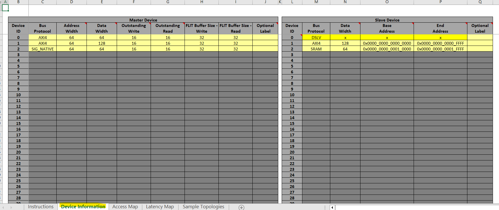
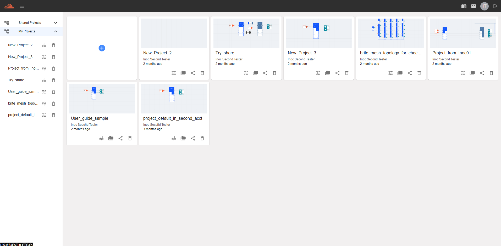
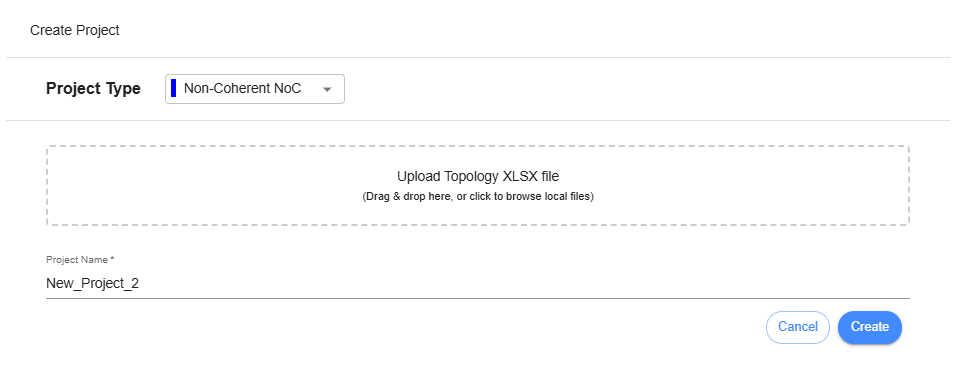
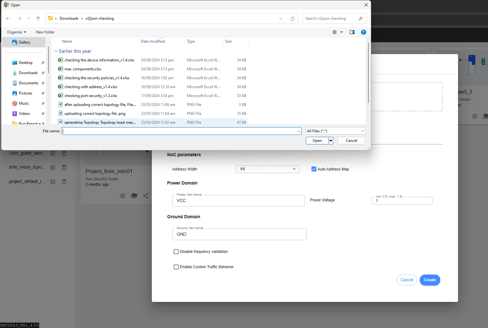
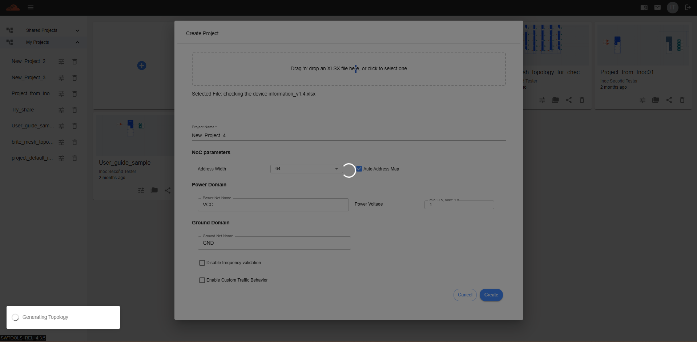
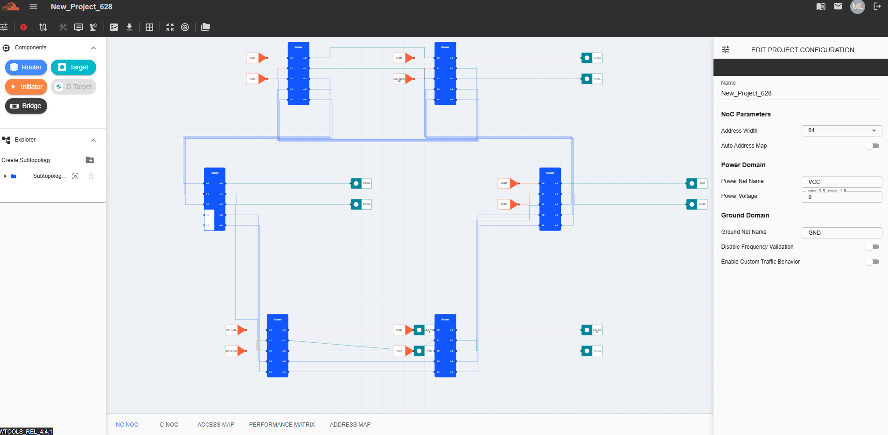

Uploading a Topology 
========================================================

To design a topology, uploading an excel file with set values will generate a topology instantly. Follow the steps below to generate a topology from an excel file. 
Prepare the Excel file with the desired values. The current template file name is 'nc-noc_topology_generator_v1.4,' which is used for designing a topology from the Excel file. Instructions are included inside the file that user may follow. Sample values that need to modify are

After setting up the excel sheet, go to inoculator.ai/login to sign in and go to Dashboard. In Dashboard, there is a huge ‘+’ icon for creating a project. Click that icon to proceed. 

After clicking that icon, ‘Create Project’ dialog box will appear. User will find a button to upload the file. Click ‘Drag ‘n drop an XLSX file here or click to select one’. 

After the user clicks the button, the file explorer of the machine will be displayed, allowing the user to select the desired file to upload.

Once user has selected the file to upload, click ‘Create’ to proceed with creation of project. 

After verification, if the generated file has no issues, it will proceed to the creation of the project. The grid view of iNoCulator must be displayed, allowing the user to see the topology. Each component must be editable, including the settings of each. 

