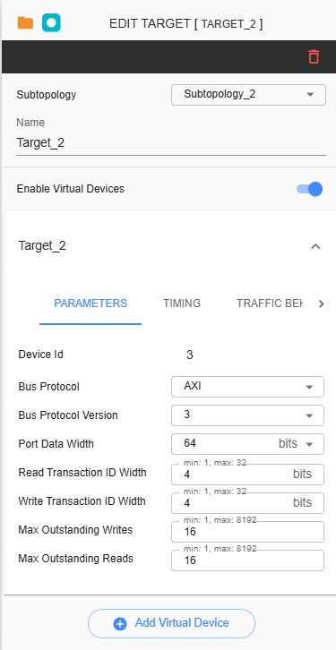
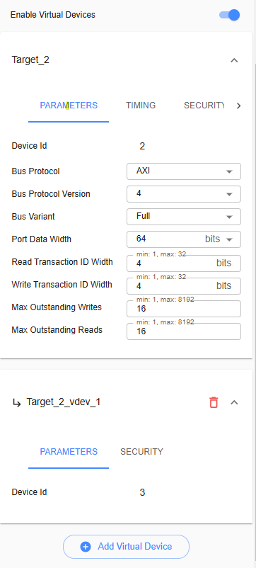
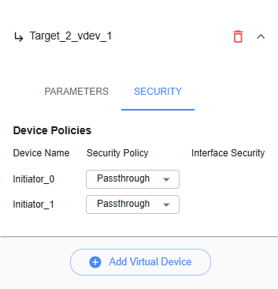

Virtual Device Configuration
======================================

Virtual Device or Virtual Target Device refers to a software-defined device that exists in a virtual environment. This can be configured in any Target Device on any port. The maximum number of devices that can be added is 64. Here’s how to add a Virtual Device in iNoCulator

1.	Select a target device from the grid and click on it. The settings for the Target Device should be displayed on the right side.
2.	Toggle the ‘Enable Virtual Device’ switch to reveal the ‘Add Virtual Device’ button at the bottom.
3.	Click the ‘Add Virtual Device’ button to configure new virtual device. 
4.	A new collapsible menu will be displayed below the Target device with the default name ‘Target_X_vdev_1’. 

Two tabs are available for configuration in the Virtual Device: ‘Parameter’ and ‘Security’.

**Parameters** - Displays the assigned Device ID. Device IDs for virtual devices are incremental with Target Devices. 

**Security** - Configuration of Device Policies (Passthrough, Programmable, Blocked, and Fixed-Secure). Each virtual device can be configured with different policies.

