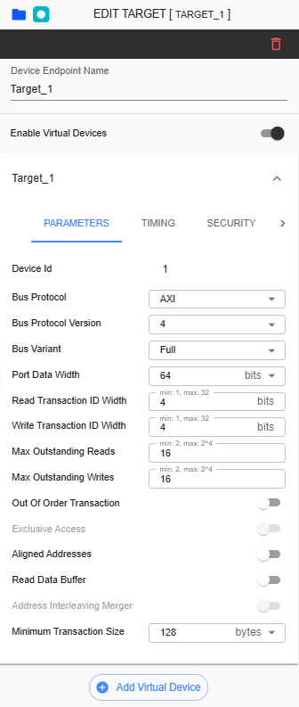
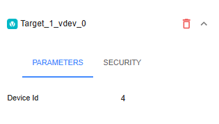
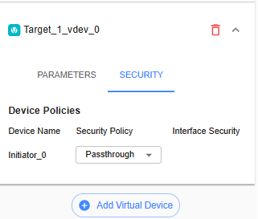
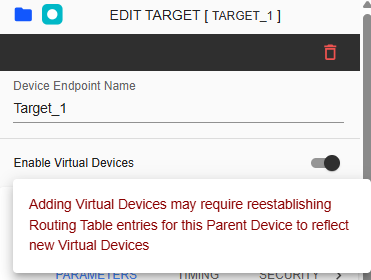
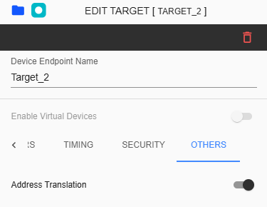

========================================================
NC-NoC Virtual Device Configuration
========================================================

A **Virtual Device** (or Virtual Target) is a software-defined endpoint abstraction that simulates a physical target device within the NoC fabric. Virtual devices allow architects to partition a single physical Target into multiple logical endpoints, each with its own independent security policy and addressing.

--------------------------------------------------------------------------------

Instantiation Workflow
==========================

You can instantiate up to **64 virtual devices** per physical target node. Follow these steps to configure them:

1. **Target Selection:** Click on the target device node within the canvas grid to populate its inspector panel on the right.
2. **Enable Virtualization:** Locate and toggle the **Enable Virtual Device** switch. This action exposes the **Add Virtual Device** button at the base of the inspector.
3. **Append Device:** Click **Add Virtual Device**. The system will append a new collapsible menu under the physical target header (default naming: ``Target_X_vdev_1``).

--------------------------------------------------------------------------------

Virtual Device Property Matrix
=================================

Once instantiated, each virtual device displays two configuration tabs:

.. grid:: 2
   :gutter: 3

   .. grid-item-card::  Parameters Tab
      :class-header: bg-light font-weight-bold

      Displays the assigned **Device ID**. Virtual device IDs maintain an incremental numerical sequence following the parent physical target's ID to ensure system-wide uniqueness.

   .. grid-item-card::  Security Tab
      :class-header: bg-light font-weight-bold

      Allows localized configuration of **Device Policies** (Passthrough, Programmable, Blocked, or Fixed-Secure). This enables granular security isolation—you can apply a unique security policy to each virtual device independent of the parent target.

--------------------------------------------------------------------------------

Operational Constraints & Guardrails
=======================================

.. warning::
   **Toggle Lockout:**
   Enabling the Virtual Device feature creates a structural dependency. You **cannot** disable the parent 'Enable Virtual Device' toggle until every associated virtual device instance has been explicitly deleted from the project. Attempting to disable the toggle with active instances will trigger a system reminder.

.. important::
   **Address Translation Conflict:**
   Virtual Targets and **Address Translation** are mutually exclusive features. If Address Translation is currently enabled for a target, the 'Enable Virtual Device' toggle will be automatically suppressed or disabled.

